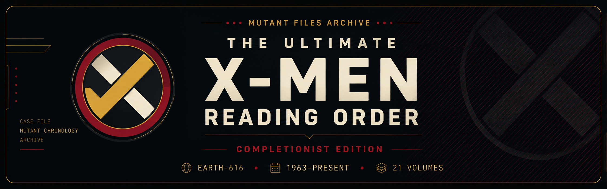

<p align="center">
  
</p>

<p align="center">
  <strong>A fan-made, completionist reading-order checklist for X-Men and Marvel's mutant universe.</strong>
</p>

<p align="center">
  <a href="#license"></a>
  <a href="#features"></a>
  <a href="#continuity-scope--audit"></a>
  <a href="#continuity-scope--audit"></a>
</p>

<p align="center">
  <a href="#overview">Overview</a>
  ·
  <a href="#features">Features</a>
  ·
  <a href="#continuity-scope--audit">Scope</a>
  ·
  <a href="#quick-start">Quick Start</a>
  ·
  <a href="#license">License</a>
</p>

---

## 📖 Overview

**The Ultimate X-Men Reading Order** is a browser-based, offline-ready checklist application built for readers who want to experience the X-Men's Earth-616 history as completely as practical.

Rather than focusing solely on an "essential reading" list, the **Completionist Edition** follows the broader mutant timeline — including major series, teams, crossovers, guest appearances, annuals, specials, and continuity-relevant side stories.

From the original **1963 X-Men** through the modern era, the goal is simple:

> **Follow the mutant timeline. Track your journey. Leave no important story behind.**

> [!NOTE]
> **Progress Units**
>
> The tracker uses **checklist entries** as its progress units. Some entries represent multiple individual issues when those issues form a single reading sequence or crossover block.
>
> Therefore, the checklist-entry count should **not** be interpreted as the total number of individual comic issues represented.

---

## ⚡ Features

| | Feature | Description |
|---|---|---|
| 📚 | **21 Chronological Volumes** | Follow the mutant timeline through major publishing eras. |
| 🎯 | **587 Checklist Entries** | A broad completionist reading order covering mainline, side, and crossover material. |
| 🔀 | **Interleaved Crossovers** | Follow complicated events in a practical reading sequence. |
| 🏷️ | **Context-Aware Labels** | Quickly identify main reading, optional material, guest appearances, specials, and other categories. |
| 💾 | **Local Progress Tracking** | Mark entries as read and keep your progress automatically in your browser. |
| 📱 | **Installable PWA** | Install the app on desktop or mobile like a native application. |
| 📴 | **Offline Capable** | Once cached, the reading tracker can continue working without an internet connection. |
| 🔒 | **Privacy First** | No account, registration, analytics tracking, or backend required. |

---

## 🧬 Continuity Scope & Audit

| Metric | Details |
| :--- | :--- |
| **Universe** | Earth-616 |
| **Time Period** | 1963 – Present |
| **Volumes** | 21 chronological volumes |
| **Checklist Entries** | 587 sequence units |
| **Publication Checkpoint** | August 13, 2026 |

### What's Included

- **X-Men** and **Uncanny X-Men** primary runs
- Major mutant team titles
  - *New Mutants*
  - *X-Factor*
  - *X-Force*
  - *Excalibur*
  - *Generation X*
  - and other major mutant teams
- Major crossover events
- Annuals and specials
- Anthology and continuity-relevant stories
- Important X-Men appearances outside their primary titles
- Significant *Avengers*, *Fantastic Four*, and other guest appearances
- Expanded Silver Age material
- *Hidden Years* era material
- Modern-era mutant titles
- Current-era material through the August 2026 publication checkpoint

> [!IMPORTANT]
> **Completionist does not mean "every comic Marvel has ever published featuring a mutant."**
>
> The goal is a practical, continuity-focused Earth-616 reading experience that captures the major X-Men story, supporting books, meaningful guest appearances, crossovers, and continuity-relevant material without turning the tracker into an unmanageable catalog of every incidental cameo.

> [!TIP]
> **Debatable Placements**
>
> X-Men continuity has decades of retcons, flashbacks, publication-order conflicts, and stories that overlap multiple eras.
>
> Where a placement is debatable, the application provides contextual information rather than pretending there is always one universally accepted answer.

---

## 🚀 Quick Start

The application is built entirely with client-side web technologies.

### Option A — Use the Live App

Once GitHub Pages is enabled, simply open the published site in your browser.

### Option B — Download the Repository

Clone the repository:

```bash
git clone https://github.com/bdredenbach/X-Men-Reading-Order-Completionist-Ed.git
